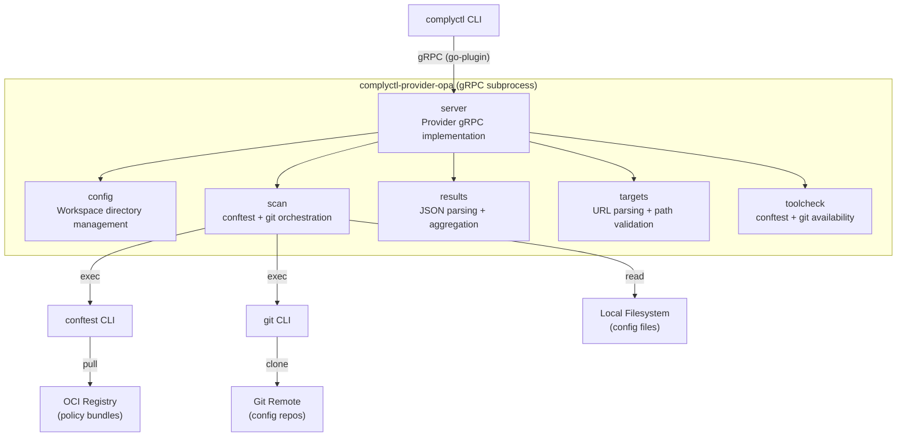

# Architecture: OPA/Conftest Configuration Policy Evaluation Provider

> Generated from `docs/specs/20260509-opa-provider.md` | Date: 2026-05-09

## Overview

The `complyctl-provider-opa` plugin extends the complyctl CLI with OPA/conftest-based
configuration policy evaluation. It implements the complyctl gRPC `Provider` interface
(Describe, Generate, Scan) using `conftest` as the policy evaluation engine and `git`
for remote repository cloning. The provider pulls OPA policy bundles from OCI registries
and evaluates configuration files (Kubernetes manifests, Terraform HCL, Dockerfiles,
CI YAML, Ansible playbooks) against them.

This is the third provider in the complytime-providers repository, joining
`openscap-provider` (XCCDF-based system scanning) and `ampel-provider` (in-toto
attestation-based policy verification). Unlike ampel, this provider evaluates
configuration files directly against Rego policies — no attestations, no DSSE,
no snappy.

The Generate phase is deferred as a follow-up item. This architecture covers Describe
and Scan, with Generate as a pass-through stub returning success.

## Architectural Decisions

| # | Decision | Chosen | Rationale |
|---|----------|--------|-----------|
| D1 | Provider name | `opa-provider` (binary: `complyctl-provider-opa`) | OPA is the broader ecosystem brand. Naming after the ecosystem, not the CLI tool. |
| D2 | Policy source | OPA bundles from OCI registry via single `opa_bundle_ref` global variable | Single bundle per assessment is simplest for v1. |
| D3 | Evaluation tool | `conftest` CLI via `CommandRunner` interface | conftest natively handles multi-format inputs, OCI bundle pulling, and structured JSON output. CLI via CommandRunner matches ampel's proven pattern. |
| D4 | Data collection | No snappy — conftest evaluates config files directly | OPA/Rego policies evaluate configuration files directly. No attestation layer needed. |
| D5 | Input sources | Both local paths (`input_path`) and remote git repos (`url`) | Supports CI pipelines, GitHub Actions, and developer workstations. |
| D6 | Git authentication | Optional `access_token`, unauthenticated if not provided | Supports public repos, internal repos behind VPN, and authenticated private repos. |
| D7 | Git clone method | Shell out to `git` CLI via `CommandRunner` | Consistent with external-tool pattern. Git CLI handles credential helpers natively. |
| D8 | OCI registry auth | Standard Docker config (`~/.docker/config.json` / `DOCKER_CONFIG`) | conftest respects Docker credential helpers natively via ORAS. Zero custom code needed. |
| D9 | Conftest namespace | `--all-namespaces` flag | Bundles are platform-specific. `--all-namespaces` ensures all packages are evaluated. |
| D10 | Result mapping | `warn` and `deny` both map to `ResultFailed`; `successes` count → aggregate pass | Both represent compliance violations. Current policies use `warn` rules. Consistent treatment. |
| D11 | Requirement ID mapping (v1) | Parse `query` field from conftest metadata to derive package-based IDs | Rego METADATA annotations are not automatically surfaced in conftest JSON output. V1 uses query-derived IDs (e.g., `docker.network_encryption`). Structured metadata extraction is a cross-repo follow-up. |
| D12 | Conftest output struct | `Successes int` (not array) | conftest's actual `CheckResult` struct uses `Successes int`. Individual pass checks are not available from conftest. |

## Component Diagram



## Interfaces and Ports

### Provider Interface (Port — implemented by server)

The provider implements three RPCs defined by `complyctl/pkg/provider`:

```go
type Provider interface {
    Describe(ctx context.Context, req *DescribeRequest) (*DescribeResponse, error)
    Generate(ctx context.Context, req *GenerateRequest) (*GenerateResponse, error)
    Scan(ctx context.Context, req *ScanRequest) (*ScanResponse, error)
}
```

### CommandRunner Interface (Port — used by scan)

Abstracts CLI subprocess execution for testability:

```go
type CommandRunner interface {
    Run(name string, args ...string) ([]byte, error)
    RunWithEnv(env []string, name string, args ...string) ([]byte, error)
}
```

- **Production adapter**: `ExecRunner` — wraps `os/exec.Command`
- **Test adapter**: `mockRunner` — records invocations, returns canned responses
- Matches the identical interface in `cmd/ampel-provider/scan/scan.go`

### External Tool Contracts

| Tool | Command | Input | Output |
|------|---------|-------|--------|
| `conftest pull` | `conftest pull oci://{bundleRef} --policy {policyDir}` | OCI reference | Rego policies written to `{policyDir}` |
| `conftest test` | `conftest test {input} --policy {policyDir} --output json --all-namespaces --no-fail` | Config file path + policies | JSON array of `CheckResult` |
| `git clone` | `git clone --branch {branch} --depth 1 {url} {cloneDir}` | Repository URL | Cloned repo at `{cloneDir}` |

### Conftest JSON Output Contract (Verified from conftest v0.68.2 source)

```go
// Local types mirroring conftest output/result.go — NOT imported as a dependency
type conftestCheckResult struct {
    Filename   string           `json:"filename"`
    Namespace  string           `json:"namespace"`
    Successes  int              `json:"successes"`
    Warnings   []conftestResult `json:"warnings,omitempty"`
    Failures   []conftestResult `json:"failures,omitempty"`
    Exceptions []conftestResult `json:"exceptions,omitempty"`
}

type conftestResult struct {
    Message  string         `json:"msg"`
    Metadata map[string]any `json:"metadata,omitempty"`
}
```

**Key constraints:**
- `Successes` is an `int` count, not an array of individual checks
- `Metadata` contains a `query` field (e.g., `"data.docker.network_encryption.warn"`) added by conftest
- Rego `# METADATA` annotations are NOT automatically surfaced — requires policy-side `rego.metadata.rule()` calls
- With `--all-namespaces`, the array contains one entry per namespace per file

## Data Flow

### Scan Flow (Primary)

```
1. complyctl sends ScanRequest with targets and global variables
   ↓
2. server.Scan() validates:
   - At least one target exists
   - Required tools (conftest, git) are available
   - Workspace directories exist (creates if needed)
   ↓
3. Extract opa_bundle_ref from global variables
   ↓
4. Pull policy bundle:
   conftest pull oci://{bundleRef} --policy {workspace}/opa/policy/
   ↓
5. For each target (sequential, graceful degradation):
   ├── Extract variables: url, input_path, branches, access_token, platform, scan_path
   ├── Validate: exactly one of url or input_path
   ├── If url (remote):
   │   ├── For each branch:
   │   │   ├── git clone --branch {branch} --depth 1 {url} {workspace}/opa/repos/{sanitized}/
   │   │   ├── Resolve scan dir: {clone_dir}/{scan_path} or {clone_dir}
   │   │   ├── conftest test {scan_dir} --policy {policy_dir} --output json --all-namespaces --no-fail
   │   │   ├── Parse JSON → PerTargetResult with Findings
   │   │   └── Write result JSON to {workspace}/opa/results/
   │   └── (Credential injection via env var, not URL-embedded)
   ├── If input_path (local):
   │   ├── Validate path exists, no traversal
   │   ├── conftest test {input_path} --policy {policy_dir} --output json --all-namespaces --no-fail
   │   ├── Parse JSON → PerTargetResult with Findings
   │   └── Write result JSON to {workspace}/opa/results/
   └── On error: log and continue to next target
   ↓
6. Aggregate all PerTargetResults → ToScanResponse()
   - Group findings by requirement ID (derived from query field)
   - Create AssessmentLog entries with steps from all targets
   - Error targets → error step under "scan-error" requirement
   ↓
7. Return ScanResponse with assessments
```

### Describe Flow

```
1. complyctl sends DescribeRequest
   ↓
2. server.Describe() checks tool availability (conftest, git)
   ↓
3. Returns DescribeResponse:
   - Healthy: true if both tools found
   - Version: "0.1.0"
   - GlobalVariables: [opa_bundle_ref]
   - RequiredTargetVariables: [url OR input_path]
   - OptionalTargetVariables: [branches, access_token, platform, scan_path]
```

### Generate Flow (Stub)

```
1. complyctl sends GenerateRequest
   ↓
2. server.Generate() returns success immediately (no-op)
```

## Integration Points

### With complyctl

- **Protocol**: gRPC subprocess via hashicorp/go-plugin
- **Discovery**: Binary named `complyctl-provider-opa` on PATH
- **Lifecycle**: complyctl starts the provider as a subprocess, communicates via gRPC, kills on completion
- **Data contract**: `provider.ScanRequest` → `provider.ScanResponse` with `AssessmentLog` entries

### With OCI Registries

- **Protocol**: OCI distribution spec via conftest (which uses ORAS internally)
- **Authentication**: Standard Docker credential store (`~/.docker/config.json`, `DOCKER_CONFIG` env var)
- **Supported registries**: GHCR, GitLab Container Registry, Quay.io, ECR, GCR, any OCI-compliant registry
- **Bundle format**: OPA bundle (Rego policies + optional data files)

### With Git Hosting

- **Protocol**: HTTPS git clone (no SSH)
- **Authentication**: Optional `access_token` injected via environment variable (not URL-embedded)
- **Platforms**: GitHub, GitLab, any HTTPS-accessible git host
- **Clone strategy**: Shallow clone (`--depth 1`) per branch

### With opa-policies-poc (Cross-repo)

- **Dependency**: Policy bundles are built and published by opa-policies-poc
- **Contract**: Rego policies with `warn`/`deny` rules that produce string messages
- **V1 limitation**: Control IDs are derived from conftest `query` field (package path). For compliance-framework-level IDs (e.g., `ITSS-CH1-ACCESS-005`), opa-policies-poc policies need to return structured objects using `rego.metadata.rule()`. This is a planned cross-repo follow-up.

## Industry Patterns

### CommandRunner for CLI Wrapping

The `CommandRunner` interface pattern for wrapping `os/exec` is established in this codebase
(ampel-provider) and in the broader Go ecosystem (Cloud Foundry's CommandRunner, Atlantis's
conftest client). The interface with `Run` and `RunWithEnv` methods provides clean test
isolation via mock implementations.

### conftest JSON Output Parsing

Production systems (Atlantis) define local Go structs mirroring conftest's `CheckResult`
rather than importing conftest as a library dependency. This keeps the consumer self-contained
and decoupled from conftest's internal dependency tree.

### OCI Registry Authentication

conftest uses ORAS for OCI operations. ORAS inherits Docker credential store configuration.
This is the standard pattern across the OCI ecosystem — no custom auth code needed.

## Error Strategy

| Error Category | Detection | Response | Result Type |
|---------------|-----------|----------|-------------|
| **Tool missing** | `exec.LookPath` fails | Describe: `Healthy: false`. Scan: error listing missing tools | N/A (error return) |
| **Bundle pull failure** | `conftest pull` non-zero exit | Error with conftest stderr, scan aborted | N/A (error return) |
| **OCI auth failure** | `conftest pull` non-zero exit | Error suggesting Docker config check | N/A (error return) |
| **Missing opa_bundle_ref** | Global variable not set | Error: "opa_bundle_ref global variable is required" | N/A (error return) |
| **Invalid target config** | Validation logic | Error for that target, continue others | Per-target error |
| **Git clone failure** | `git clone` non-zero exit | Error suggesting access_token if not provided | Per-target error |
| **Conftest evaluation error** | JSON output empty/unparseable after exit 0 | `ResultError` step in response | `ResultError` |
| **Policy violation** | `Failures`/`Warnings` in conftest JSON | `ResultFailed` step per violation | `ResultFailed` |
| **Path traversal** | `..` in input_path, branches, or scan_path | Validation error, target rejected | Per-target error |

**Graceful degradation**: Per-target failures do not abort the entire scan. Each target
is processed independently; errors are logged and included in the response alongside
successful results. This matches ampel-provider's error handling pattern.

**`--no-fail` pitfall**: conftest returns exit 0 even on policy violations when
`--no-fail` is used. This means exit code cannot distinguish "no violations" from
"violations found." The real error detection shifts to JSON parsing: if output is
empty or unparseable after a successful exit, that indicates a tool error, not success.

## Concurrency Model

Not applicable for v1. Targets are processed sequentially within the Scan RPC (same as
ampel). The gRPC framework handles concurrent request isolation at the subprocess level
via hashicorp/go-plugin. No mutexes, channels, or goroutines needed in provider code.

## V1 Known Limitations

1. **Successes are counts, not individual checks**: conftest's `Successes` field is an
   integer count. The provider cannot produce individual "pass" findings per check.
   Instead, it reports only violations as individual findings and uses the successes
   count as an aggregate indicator.

2. **Requirement IDs are package-derived**: Rego `# METADATA` annotations are not
   automatically surfaced in conftest JSON output. V1 derives requirement IDs from the
   `query` field in conftest metadata (e.g., `data.docker.network_encryption.warn` →
   `docker.network_encryption`). Compliance-framework-level IDs (e.g., `ITSS-CH1-ACCESS-005`)
   require opa-policies-poc policies to return structured objects using
   `rego.metadata.rule()`. This is a cross-repo follow-up.

3. **Generate phase is a stub**: Returns success immediately. Future design needed to
   determine if/how Generate should prepare policy artifacts for OPA.

4. **Sequential target processing**: Targets are processed one at a time. Parallel
   evaluation could improve performance for multi-target assessments but adds complexity.
