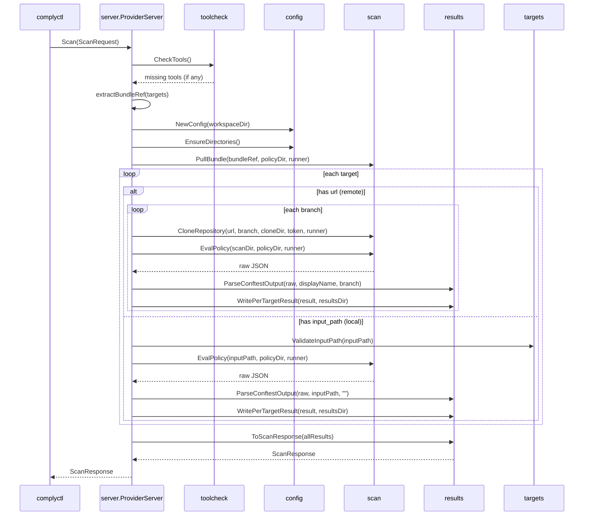

# OPA Provider — Internal Architecture

This document describes the internal architecture, data flow, design decisions,
and package dependencies of the `complyctl-provider-opa` plugin.

## Component Overview

The OPA provider is a gRPC subprocess plugin that evaluates configuration files
against OPA/Rego policies using `conftest` as the policy engine. It is one of
three providers in the `complytime-providers` repository, alongside `openscap`
(XCCDF-based system scanning) and `ampel` (in-toto attestation-based
verification).

The provider is self-contained under `cmd/opa-provider/` with six subpackages.
There is no shared library code between providers — `internal/complytime/`
contains only test fixtures for the openscap provider.

### Package Responsibilities

| Package | Responsibility |
|:--------|:---------------|
| `main` | Binary entry point — instantiates server and hands off to plugin framework |
| `server` | Implements the `provider.Provider` gRPC interface (Describe, Generate, Scan) |
| `config` | Manages workspace directory structure for OPA artifacts |
| `scan` | Orchestrates external tool execution (conftest pull/test, git clone) |
| `results` | Parses conftest JSON output and maps findings to complyctl assessment format |
| `targets` | Resolves repository URLs, validates input paths, produces display names |
| `toolcheck` | Verifies that required external tools (conftest, git) are on PATH |

## Data Flow



## Package Dependency Graph

Dependencies flow inward — `server` depends on all other packages, but no
inner package depends on `server`.

```
main
 └── server
      ├── config
      ├── scan
      ├── results
      ├── targets
      └── toolcheck
```

No circular dependencies exist. Each inner package depends only on the standard
library and `complyctl/pkg/provider` (for type definitions in `results`).

## Key Design Decisions

### 1. Conftest as the policy engine (not OPA directly)

The provider uses `conftest` rather than the OPA Go library or the `opa` CLI.
Conftest provides built-in support for parsing multiple configuration formats
(YAML, JSON, HCL, Dockerfile, INI) and supports OCI bundle pulling natively.
Using conftest avoids reimplementing format parsers and OCI client logic.

### 2. External process execution via CommandRunner interface

All tool invocations (`conftest`, `git`) go through the `scan.CommandRunner`
interface rather than calling `os/exec` directly. This enables comprehensive
unit testing with mock runners — the test suite never executes real commands.

### 3. Policy bundle shared across targets

The OPA policy bundle is pulled once per `Scan()` call, not per target. All
targets in a single scan request share the same policy bundle. The `opa_bundle_ref`
is extracted from the first target that declares it.

### 4. Per-target error isolation

When a target fails (clone error, policy evaluation error, parse error), the
error is captured in the results and the scan continues to process remaining
targets. Only global errors (no targets, missing bundle ref, tool check failure,
bundle pull failure) cause `Scan()` to return an error.

### 5. Requirement ID derivation from conftest query metadata

Conftest results include a `metadata.query` field that identifies which Rego
rule produced the finding (e.g., `data.kubernetes.run_as_root.deny`). The
provider strips the `data.` prefix and the rule type suffix (`warn`, `deny`,
`violation`) to derive a requirement ID (`kubernetes.run_as_root`). This is a
v1 approach — structured Rego METADATA with explicit control IDs is a cross-repo
follow-up.

### 6. Token injection via environment variables

Access tokens for private repositories are injected through platform-specific
environment variables (`GITHUB_TOKEN` or `GITLAB_TOKEN`), never as command-line
arguments. This prevents token leakage in process listings. The platform is
auto-detected from the URL hostname.

### 7. Generate phase deferred

The `Generate` RPC returns success without performing any work. Generating
provider-specific policy artifacts from OSCAL assessment plans is deferred to a
future iteration. The Scan phase operates with pre-built OCI bundles.

### 8. Shallow clones for remote repositories

Remote repositories are cloned with `--depth 1` to minimize network transfer
and disk usage. Each branch is cloned into a separate directory under the
workspace.

## Error Handling Strategy

The provider follows a two-tier error model:

**Tier 1 — Global errors (Scan returns error):**

- No targets provided
- `opa_bundle_ref` not set on any target
- Required tools not found
- Policy bundle pull failure

These represent unrecoverable states where no meaningful results can be produced.

**Tier 2 — Per-target errors (captured in results):**

- Target validation failures (both url and input_path set, neither set, bad
  URL scheme, path traversal)
- Git clone failures
- Policy evaluation failures
- Conftest output parse failures

These are recorded as error results with `status: "error"` and the scan
continues processing remaining targets. The error details appear in the
`ScanResponse` as assessment steps with `ResultError`.

## Security Considerations

### Input validation

- Repository URLs must use HTTPS — HTTP is rejected
- Branch names are validated against `^[a-zA-Z0-9._/-]+$` and checked for `..`
  traversal
- `scan_path` is checked for `..` traversal
- `access_token` is checked for control characters (`\n`, `\r`, `\x00`)
- Local `input_path` is validated for existence and traversal

### Credential handling

- Access tokens are injected via environment variables, not command-line
  arguments
- `GIT_TERMINAL_PROMPT=0` is set to prevent interactive auth prompts that could
  hang the subprocess
- Existing environment variables with the same name are filtered before
  injection

### File permissions

- Workspace directories are created with mode `0750`
- Result files are written with mode `0600`

## Concurrency Model

The provider processes targets sequentially within a single `Scan()` call.
There is no goroutine-level parallelism. The complyctl framework may invoke
multiple `Scan()` calls, but each runs in its own gRPC handler goroutine
managed by the framework.
